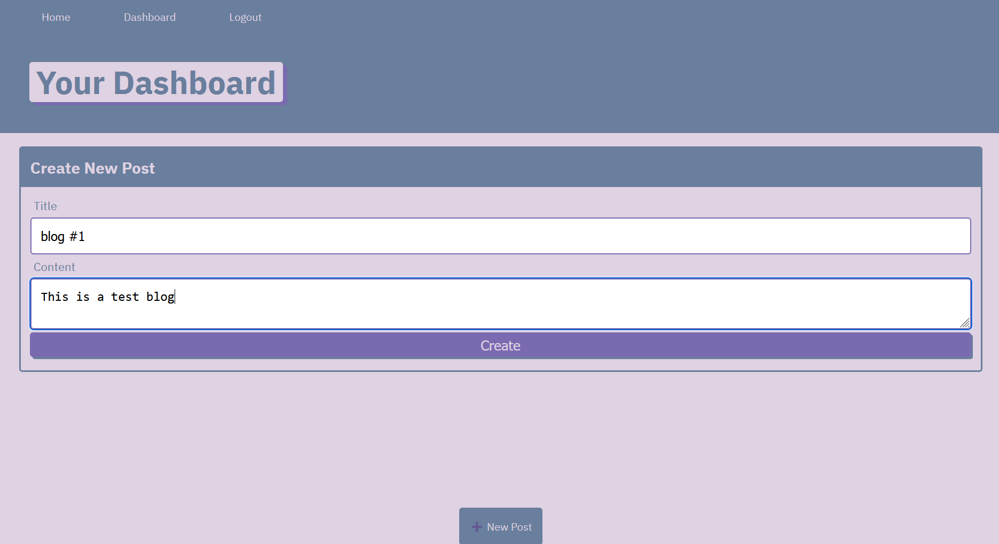
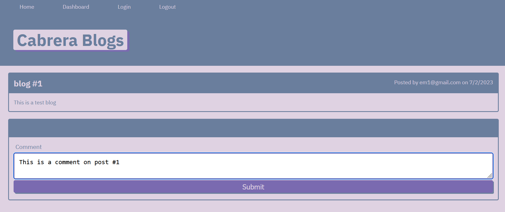
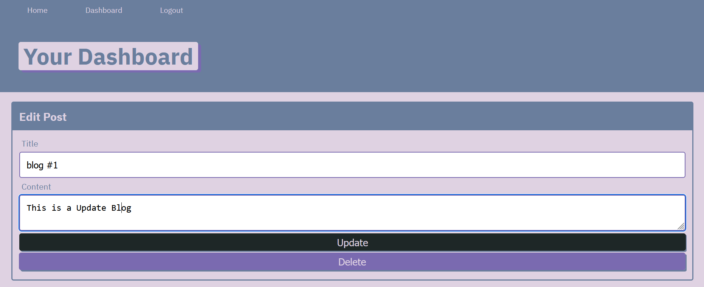

# Blog-App

## Description
This application shows a Blog APP where the user will have to signUp, to create blog post.

Also the LogIn user will be able to edit and delete their own blogs post.

Other users will be able to comment on other users blog post.

## Installation

This application uses the following packages:
    dotenv
    express
    mysql2
    sequelize
    bcrypt
    connect-session-sequelize
    express-handlebars
    express-session

To install all the dependecies run:

npm i 

OR 

Install all the packages one by one

## Usage

To run the following app run the following command:

node server.js

OR

nodemon server.js

## Contact Information

    GitHub: boro101094
    Email: boro101094@gmail.com

## Screenshots

Create a BLOG

Comment on a Blog

Update/Delete Blog

